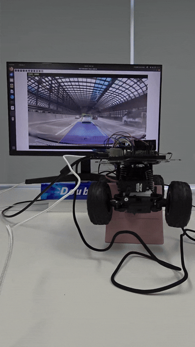

# 🏎️ ROS ROYCE: Autonomous Driving Edge Control System

## 📌 1. Project Overview
**"Edge-Device에서의 실시간 자율주행 인지 및 하드웨어 제어 파이프라인 최적화"**

제한된 컴퓨팅 자원을 가진 엣지 디바이스(NVIDIA Jetson Xavier NX)에서 자율주행 알고리즘을 구동할 때 발생하는 **레이턴시(Latency) 병목 현상을 해결**하기 위해 기획된 프로젝트입니다. 
사전 녹화된 주행 영상을 실시간으로 스트리밍하여 추론(Inference)하고, 그 결과를 바탕으로 실제 조향(Servo) 및 속도(DC Motor)를 제어하는 단일 노드 기반의 C++ ROS2 시스템을 구축했습니다.

## 🚀 2. Key Features
- **Real-time Perception Pipeline:** TensorRT를 활용해 Lane Segmentation(차선 인식)과 YOLO-based Object Detection(객체 인식)을 동시에 수행합니다.
- **Inverse Perspective Mapping (IPM):** 2D 이미지 기반의 객체 인식 결과를 3D 공간의 실제 거리 데이터로 변환하여 정밀한 제어 로직을 구현했습니다.
- **Hardware Control Integration:** 추론된 데이터를 바탕으로 `sysfs`를 통해 GPIO 및 PWM 신호를 직접 제어하여 모터를 구동합니다.
- **Custom Dataset via Pseudo-labeling:** 인식률 향상을 위해 Pseudo-labeling 기법을 적용하여 다중 클래스 커스텀 데이터셋을 구축하고 모델을 최적화했습니다.

## 🛠 3. Tech Stack
- **Hardware:** NVIDIA Jetson Xavier NX
- **OS & Environment:** Ubuntu 20.04, JetPack 5.x (L4T R35)
- **Framework:** ROS 2 Foxy (C++)
- **AI & Vision:** TensorRT 8.4+ (FP16/FP32), OpenCV 4.x
- **Hardware Interface:** `sysfs` GPIO, PWM Control

## 🏗 4. System Architecture

시스템은 단일 노드(Single Node), 단일 스레드(Single Thread) 기반의 동기 루프로 설계되어 오버헤드를 최소화했습니다.

